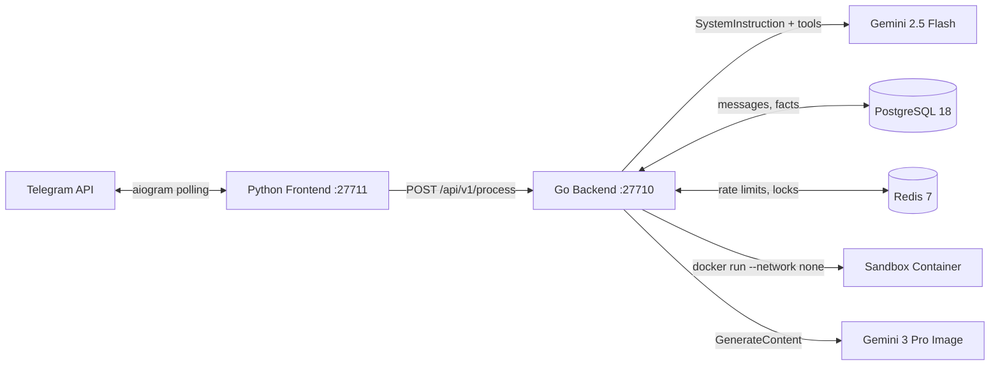

# Gryag V2 — Architecture

## System Overview

Gryag is a Telegram bot powered by Gemini 2.5 Flash, built as a **Python frontend + Go backend** split architecture.



## Component Responsibilities

| Component | Language | Role |
|-----------|----------|------|
| **Frontend** (`frontend/`) | Python 3.12 | Telegram polling, typing indicators, media sending, correlation IDs |
| **Backend** (`backend/`) | Go 1.24 | All thinking: config, i18n, DB, Redis, Gemini SDK, tools, rate limiting |
| **PostgreSQL** | — | Messages, user facts, chat summaries, media cache, schema migrations |
| **Redis** | — | Sliding-window rate limits, queue locks (exclusive processing per chat) |
| **Sandbox** | Python 3.12 | Isolated code execution: `--network none`, `--read-only`, resource limits |

## Request Flow

1. **Telegram → Frontend**: `aiogram` receives message, generates `uuid4` request ID
2. **Frontend → Backend**: `POST /api/v1/process` with JSON payload + `X-Request-ID` header
3. **Rate Limit Check**: 3-tier — global chat → per-user → queue lock (silent 204 on throttle)
4. **Message Logged**: Every message stored in PostgreSQL (even throttled ones)
5. **Dynamic Instructions Built**: 7-block prompt assembled from DB context
6. **Gemini Called**: `SystemInstruction` (persona) + Dynamic Instructions + registered tools
7. **Tool Execution**: If Gemini calls a tool, executor dispatches + returns results
8. **Reply Stored**: Bot reply logged to PostgreSQL for future context
9. **Response Sent**: JSON with `reply`, optional `media_url`/`media_type`
10. **Frontend → Telegram**: Text, photo, or document sent back to user

## Dynamic Instructions (7 Blocks)

```
1. Current Time & Chat Info
2. Available Tools (descriptions)
3. 30-Day Summary
4. 7-Day Summary
5. Immediate Chat Context (last N messages)
6. Current User Facts
7. Multi-Media Buffer (up to 10 items)
8. Current Message
```

## Memory Architecture (3 Layers)

| Layer | Storage | TTL |
|-------|---------|-----|
| **Short-Term** (immediate context) | PostgreSQL `messages` | Last N messages per config |
| **Long-Term Facts** | PostgreSQL `user_facts` | Permanent, dedup by MD5 |
| **Consolidated Summaries** | PostgreSQL `chat_summaries` | 7-day and 30-day windows |
