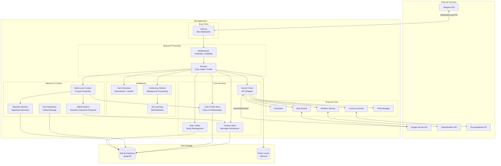
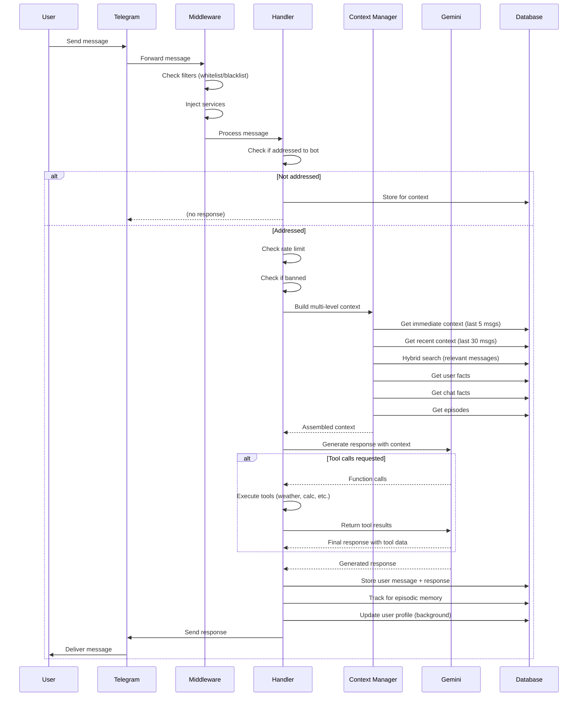
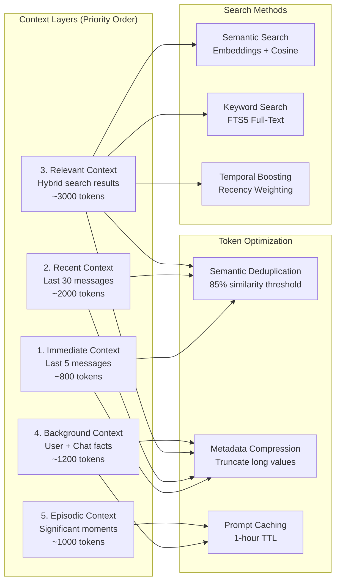
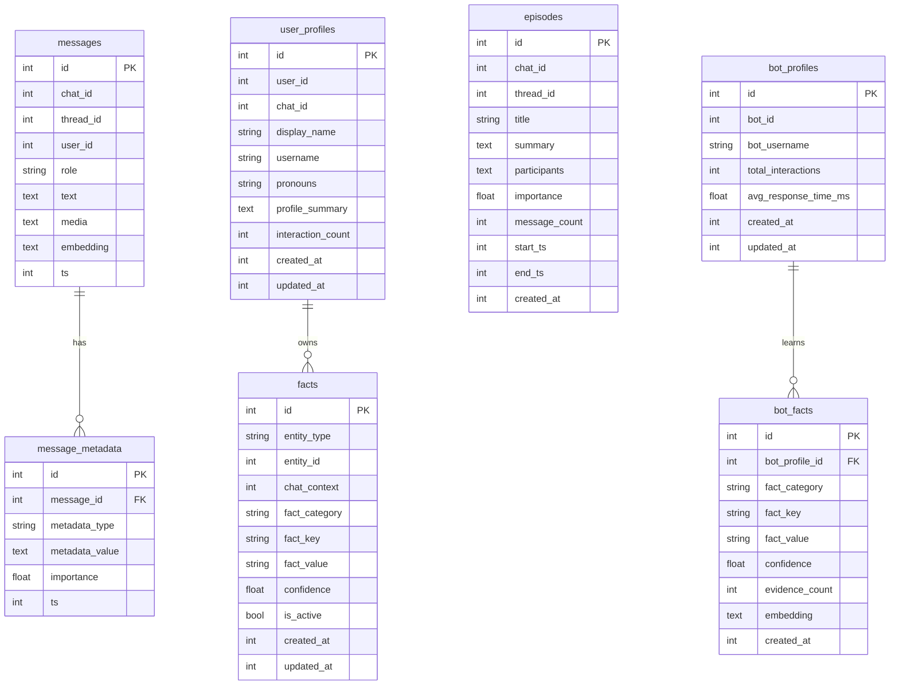

# Gryag Bot - System Architecture

This document provides a comprehensive overview of the Gryag bot architecture, including system diagrams, component interactions, and data flows.

## Table of Contents

- [System Overview](#system-overview)
- [Architecture Diagrams](#architecture-diagrams)
- [Core Components](#core-components)
- [Data Flow](#data-flow)
- [Technology Stack](#technology-stack)

## System Overview

Gryag is a sophisticated Telegram bot powered by Google Gemini AI with advanced memory, context management, and self-learning capabilities. The system is designed for high-quality conversational experiences in group chats with persistent memory and contextual awareness.

### Key Capabilities

- **Multi-Level Context Assembly**: 5-layer context system (immediate, recent, relevant, background, episodic)
- **Hybrid Search**: Semantic + keyword + temporal search for message retrieval
- **User Profiling**: Automatic fact extraction and user preference tracking
- **Episodic Memory**: Long-term memory of significant conversation moments
- **Bot Self-Learning**: Tracks effectiveness and adapts persona based on interactions
- **Tool-Based Memory Control**: Gemini function calling for dynamic memory operations
- **Multi-Modal Support**: Images, videos, audio, YouTube URLs
- **Chat Public Memory**: Group-level shared knowledge and preferences

## Architecture Diagrams

### High-Level System Architecture



### Message Processing Flow



### Multi-Level Context Assembly



### Database Schema Overview



## Core Components

### 1. Entry Point (`app/main.py`)

**Responsibilities**:
- Initialize bot and dispatcher
- Load configuration and validate
- Set up all services (17+ services)
- Register middlewares and routers
- Start background tasks (episode monitoring, resource monitoring)
- Handle graceful shutdown

**Key Services Initialized**:
- `ContextStore` - Message persistence
- `GeminiClient` - AI API wrapper
- `UserProfileStoreAdapter` - User memory
- `HybridSearchEngine` - Message retrieval
- `EpisodicMemoryStore` - Long-term memory
- `RateLimiter` - Quota management
- `BotProfileStore` - Self-learning
- `SystemPromptManager` - Custom prompts

### 2. Handlers (`app/handlers/`)

**Chat Handler** (`chat.py` - 1520 lines):
- Main message processing
- Multi-level context assembly
- Tool definition and execution
- Media handling (images, video, audio)
- Profile enrichment
- Response sanitization

**Admin Handlers**:
- `admin.py` - Ban/unban, rate limits, stats
- `profile_admin.py` - User profile management
- `chat_admin.py` - Chat facts management
- `prompt_admin.py` - System prompt configuration

### 3. Services

#### Memory & Context (`app/services/context/`)

**MultiLevelContextManager**:
- Assembles 5-layer context within token budget
- Parallel retrieval (<500ms)
- Token optimization (25-35% reduction)

**HybridSearchEngine**:
- Combines semantic (embeddings) + keyword (FTS5) + temporal (recency)
- Configurable weights (default: 50% semantic, 30% keyword, 20% temporal)
- Returns most relevant messages

**EpisodicMemoryStore**:
- Stores significant conversation moments
- Episode boundary detection (semantic, temporal, topic markers)
- Automatic episode creation and summarization

#### User Management (`app/services/`)

**UserProfileStoreAdapter**:
- Wrapper around `UnifiedFactRepository`
- Manages user facts, relationships, pronouns
- Profile summarization
- Backward-compatible interface

**ChatProfileRepository**:
- Group-level memory (chat facts)
- Shared preferences and culture
- Token budget management (40% of background context)

**BotProfileStore** (Phase 5):
- Tracks bot effectiveness metrics
- Semantic deduplication of learnings
- Temporal decay for outdated facts
- Gemini-powered self-reflection

#### AI Integration (`app/services/gemini.py`)

**GeminiClient**:
- Wraps `google-genai` SDK
- Auto-detects model capabilities (audio, video, tools)
- Circuit breaker pattern (max 3 failures, 60s cooldown)
- Media filtering by model support
- Tool execution with retry logic
- Safety settings (BLOCK_NONE for all categories)

#### Fact Extraction (`app/services/fact_extractors/`)

**HybridFactExtractor**:
- 2-tier extraction: rule-based (fast) + Gemini fallback
- Ukrainian and English pattern support
- Confidence scoring (0.0-1.0)
- Evidence tracking

### 4. Middlewares (`app/middlewares/`)

**ChatMetaMiddleware**:
- Injects all services into handlers
- Reuses single `MultiLevelContextManager` instance
- Makes services available via aiogram's dependency injection

**ChatFilterMiddleware**:
- Pre-processes messages before handlers
- Whitelist/blacklist enforcement
- Prevents wasting resources on blocked chats

### 5. Database Layer

**SQLite with WAL Mode**:
- Single file database (`gryag.db`)
- 100+ indexes for performance
- FTS5 for full-text search
- Atomic transactions

**Main Tables**:
- `messages` - Chat history with embeddings (7 columns, 15 indexes)
- `facts` - Unified user + chat facts (13 columns, 8 indexes)
- `user_profiles` - User metadata (15 columns, 5 indexes)
- `episodes` - Episodic memory (12 columns, 6 indexes)
- `bot_profiles` + 5 related tables - Self-learning system

## Data Flow

### Inbound Message Flow

1. **Telegram → Bot**
   - User sends message to Telegram
   - Telegram forwards to bot via webhook/long poll

2. **Middleware Processing**
   - `ChatFilterMiddleware`: Check whitelist/blacklist
   - `ChatMetaMiddleware`: Inject services

3. **Handler Routing**
   - Dispatch to appropriate handler (chat, admin, etc.)
   - Check if message addressed to bot
   - Early exit if not addressed (store for context only)

4. **Rate Limiting & Bans**
   - Check user's hourly quota (skip for admins)
   - Check if user banned in this chat
   - Return error if limits exceeded

5. **Context Assembly**
   - `MultiLevelContextManager` builds 5-layer context
   - Parallel retrieval from database
   - Token budget enforcement (default 8000 tokens)

6. **AI Generation**
   - Send to Gemini with context + tools
   - Execute any tool calls (calculator, weather, memory, etc.)
   - Get final response

7. **Persistence**
   - Store user message with embedding
   - Store bot response
   - Track for episode creation
   - Update user profile (background task)

8. **Response Delivery**
   - Clean metadata from response
   - Escape Markdown for Telegram
   - Send reply to user

### Outbound Data Flow (Bot Learning)

1. **Interaction Tracking**
   - Log: response_time_ms, token_count, tools_used
   - Store in `bot_interaction_outcomes`

2. **Reaction Processing**
   - Detect user reactions (positive/negative sentiment)
   - Update interaction outcome with feedback

3. **Fact Extraction (Background)**
   - Analyze successful/failed interactions
   - Extract learnings about bot behavior
   - Store in `bot_facts` with confidence scores

4. **Self-Reflection (Weekly)**
   - Gemini analyzes bot performance
   - Generates insights about effectiveness
   - Stores persona adaptation rules

### Memory Operation Flow (Tool-Based)

1. **Gemini Decides to Remember**
   - Gemini calls `remember_fact` tool during generation
   - Parameters: user_id, fact_type, fact_key, fact_value, confidence

2. **Tool Execution**
   - Handler executes tool callback
   - Stores fact in `facts` table via `UnifiedFactRepository`
   - Returns success confirmation to Gemini

3. **Gemini Recalls Facts**
   - Gemini calls `recall_facts` tool
   - Parameters: user_id, fact_type (optional), query (optional)

4. **Tool Execution**
   - Searches facts with filters
   - Returns JSON list of matching facts
   - Gemini incorporates into response

## Technology Stack

### Core Technologies

- **Python 3.11+** - Runtime
- **aiogram 3.5+** - Telegram Bot framework (async)
- **google-genai 0.2+** - Google Gemini SDK
- **aiosqlite 0.20+** - Async SQLite driver
- **pydantic 2.6+** - Settings validation

### Data & Storage

- **SQLite** - Primary database (WAL mode)
- **FTS5** - Full-text search
- **Redis 7** (optional) - Caching & sessions

### External APIs

- **Google Gemini API** - AI generation & embeddings
- **OpenWeatherMap API** (optional) - Weather data
- **ExchangeRate API** (optional) - Currency rates

### Development Tools

- **pytest 8.0+** - Testing framework
- **black** - Code formatting
- **ruff** - Linting
- **mypy** - Type checking
- **pytest-asyncio** - Async test support

### Infrastructure

- **Docker** - Containerization
- **Docker Compose** - Multi-service orchestration
- **GitHub Actions** - CI/CD

## Performance Characteristics

### Latency Targets

- **Message handling**: <2s end-to-end
- **Context assembly**: <500ms
- **Hybrid search**: <200ms
- **Memory tool operations**: <200ms
- **Gemini API calls**: 1-3s (external)

### Token Optimization

- **Baseline**: ~12,000 tokens/turn
- **Optimized**: ~8,000 tokens/turn (33% reduction)
- **Methods**:
  - Semantic deduplication (15-30% savings)
  - Metadata compression (30-40% savings)
  - Prompt caching (50ms faster on cache hit)

### Resource Usage

- **Memory**: ~100-200 MB (bot process)
- **Database**: ~10-50 MB (depends on history)
- **CPU**: Minimal (<5% on i5-6500)

## Security Considerations

### API Key Protection

- All API keys stored in `.env` (not in code)
- `.env` in `.gitignore`
- Logging sanitization (no keys in logs)

### Rate Limiting

- Per-user hourly limits (default: 5 messages/hour)
- Admins bypass rate limits
- Ban system for abuse prevention

### Data Privacy

- User data retention configurable (default: 30 days)
- Facts can be deleted via `/forget_fact` tool
- Profile reset available to admins

### Input Validation

- Pydantic validation for all settings
- SQL injection prevented (parameterized queries)
- Markdown escaping for Telegram output

## Deployment

### Docker Deployment (Recommended)

```bash
docker-compose up -d
```

### Manual Deployment

```bash
python -m venv venv
source venv/bin/activate
pip install -r requirements.txt
python -m app.main
```

### Environment Variables

See `.env.minimal` for required settings and `.env.example` for full options.

---

**Last Updated**: 2025-10-16
**Version**: 0.1.0
**Authors**: Gryag maintainers
